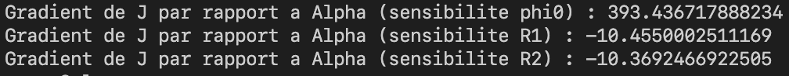
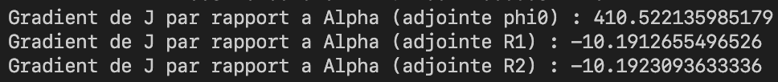
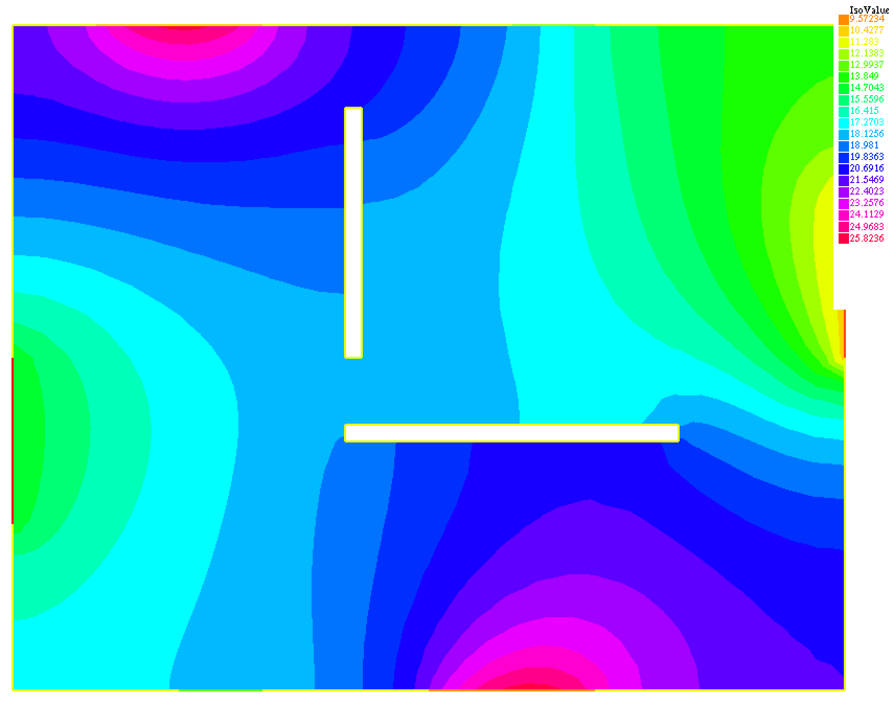
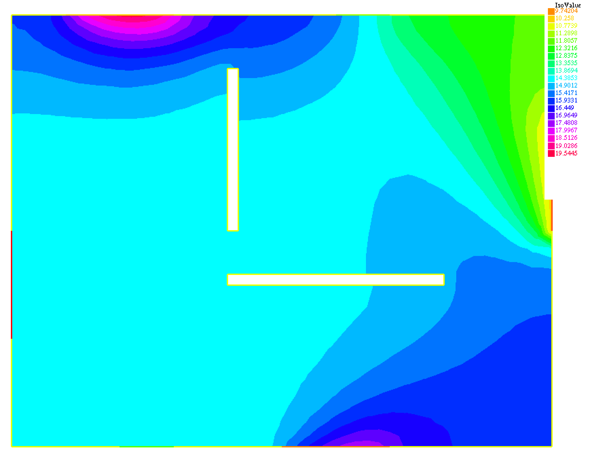

[comment]: # (To generate the PDF (HTML), use `pandoc --toc --standalone --katex rapport.md -o rapport.pdf (rapport.html)`)

\newpage

# Introduction

Dans ce projet, on souhaite déterminer les flux de chaleur $R_1$ ($\phi _{R_1}$) et $R_2$ ($\phi _{R_2}$) et d'air $v$ ($\phi _0$) pour obtenir une température moyenne de 19°C dans la pièce.

Dans un premier temps, on modélise le problème par des équations aux dérivées partielles qu'on va resoudre à l'aide de la méthode des élements finis.

Dans un second temps, on utilise l'algorithme de descente du gradient pour trouver les flux de chaleurs optimaux. On s'interessera particulièrement à trois méthodes de calcul du gradient qui sont:

- L'approche par différences finies
- La méthode de l'équation de sensibilité
- La méthode de l'équation adjointe

# Modélisation

## Aérodynamique 

### Champ de vitesse

- On suppose que le champ de vitesse dérive d'un potentiel :

la vitesse est donc donnée par:

\begin{align}
\overrightarrow U(x,y) = \overrightarrow{grad} \phi(x,y) = \nabla \phi(x,y)
\end{align}

- On suppose que l'écoulement est incompressible:

\begin{align}
div(\overrightarrow{U}) = 0
\end{align}

Les équations (1) et (2) donnent : 

\begin{align}
\Delta \phi = 0  \text{  sur  } (\Omega)
\end{align}

### Conditions aux limites:

- Mur + radiateurs glissants + fenêtre: $\overrightarrow U . \overrightarrow n = 0  \text{ sur }  (\Gamma _R \cup \Gamma _ W  \cup \Gamma _F )$  où $\Gamma _F  = \Gamma _{F_N} \cup \Gamma _{F_S}$

    Donc $$ \overrightarrow{\nabla \phi} . \overrightarrow n  = 0$$

- Flux sortant controlé : $\overrightarrow U . \overrightarrow n = \phi _0$ 

    Donc $$ \overrightarrow{\nabla \phi} . \overrightarrow n  = \phi _0 \text{ sur } (\Gamma _0)$$

- Potentiel fixé entré : $\phi = \phi _i  \text{ sur } (\Gamma _V)$

## Thermique

### Champ de température

On prend en compte les effets de convection et de diffusion:

$$ \underbrace{\overrightarrow{U}.\overrightarrow{\nabla T}}_{Convection} = \underbrace{\mu \Delta T }_{diffusion} $$

- $T(x,y)$ : champ de température

- $\mu$ : coefficient de diffusion

### Conditions aux limites :

- Murs isolants: $\overrightarrow{\nabla T}.\overrightarrow{n} = 0 \text{ sur } (\Gamma _W)$

- Température fixée aux fenêtres : $T = T_{F_N}$, $T = T_{F_S}$

- Pas de flux sur la ventilation : $\overrightarrow{\nabla T}.\overrightarrow{n} = 0 \text{ sur } (\Gamma _V)$

- flux controlé sur les radiateurs :

$$ \overrightarrow{\nabla T}.\overrightarrow{n} = \phi _{R_1} \text{ sur } (\Gamma _{R_1}) $$

$$ \overrightarrow{\nabla T}.\overrightarrow{n} = \phi _{R_2} \text{ sur } (\Gamma _{R_2}) $$

# Resolution numérique

Dans cette partie, on se propose de resoudre les équations ci-dessus avec la méthode des élements finis.

Pour cela on va trouver la formulation variationnelle des équations.

On cherche $\phi$ vérifiant: $\int_{(\Omega)} \Delta \phi v d \Omega = 0 \text{ } \forall v$

On réalise une intégration par parties (IPP):

$$ - \int_{(\Omega)} \overrightarrow{\nabla T}.\overrightarrow{\nabla v} d \Omega + \int_{(\Gamma)} \overrightarrow{\nabla T}.\overrightarrow{n} v d \Gamma = 0 $$

On cherche $\phi \in H_{\Gamma _i}^1$ tel que:

$$ - \int_{(\Omega)} \overrightarrow{\nabla T}.\overrightarrow{\nabla v} d \Omega + \int_{(\Gamma _i)} \phi _i v d \Gamma = 0 \text{ } \forall v \in H_{\Gamma _i}^1 $$

On cherche $T$ vérifiant:

$$ \int_{(\Omega)} [\overrightarrow{U}.\overrightarrow{\nabla T} - \mu \Delta T] v d \Omega  = 0 $$

On réalise une IPP comme pour l'équation précédente et on obtient:

$$ \int_{(\Omega)} [\overrightarrow{U}.\overrightarrow{\nabla T} + \mu \overrightarrow{\Delta T}.\overrightarrow{\Delta v}] d \Omega  - \int_{\Gamma} \mu \overrightarrow{\nabla T}. \overrightarrow{n} v d \Gamma = 0  \text{ } \forall v$$

On cherche $T \in H_{\Gamma _i}^1$ tel que:

$$ \int_{(\Omega)} [\overrightarrow{U}.\overrightarrow{\nabla T} + \mu \overrightarrow{\Delta T}.\overrightarrow{\Delta v}] d \Omega  - \int_{\Gamma _{R_1} \cup \Gamma _{R_2}} \mu  \phi _R v d \Gamma = 0  \text{ } \forall v \in H_{\Gamma _{F}}^1 $$

On utilise `FreeFem++` pour resoudre ces équations. Puis on va utiliser les resultats pour resoudre notre problème d'optimisation qui va consister à minimiser la fonction coût suivante:

$$ J = \frac{1}{2} \int_{\Omega} (T(x,y) - T^{*})^2 d \Omega$$

$T^{*} = \text{19°C}$ : Température cible 

# Optimisation

On va utiliser l'algorithme de descente du gradient. nous nous intéressons donc à trois méthodes de calcul du gradients.
Avant d'arriver à ces méthodes, expliquons un peu le principe générale de cet algorithme.

## Algorithme de descente du gradient

Soit une fonction $f: \mathbb{R}^n \to \mathbb{R}$, $P \mapsto f(P)$ avec $P = (a_1, \cdots a_n)$ dont on sait calculer le gradient $grad f(P)$. 

L'algorithme du gradient est donnée par:

**Données**
- Un point initial $P_0 \in \mathbb{R}$
- un niveau d'erreur $\epsilon > 0$

**Itération**

On calcule une suite de points $P_1, P_2, \cdots \in  \mathbb{R}^n$ par récurrence de la façon suivante. Supposons que l'on ait déjà obtenu le point $P_k$ :

- On calcul $grad f(P_k)$,
- On choisit un pas $\delta$ (appelé learning rate dans le monde de l'apprentissage automatique) et on calcule

$$ P_{k+1} = P_k - \delta grad f(P_k) $$

**Arrêt**

On s'arrête lorsque $\|(grad f(P_k)) \|\leq \epsilon$.

On peut aussi choisir un nombre d'itérations (epochs dans l'apprentissage automatique).

Cette méthode depend du calcul du gradient de la fonction qu'on cherche à minimiser. Intéressons nous donc à trois méthodes de calcul de ce gradient.

## Approche par différences finies

Soit $\alpha$ le paramètre à optimiser: $\alpha \in \mathbb{R}$

Dans notre cas $\alpha$ peut-être $\phi _0$, $\phi _{R_1}$ et $\phi _{R_2}$

$T(\alpha)$ : solution de l'EDP (trouvé par la méthode des élements finis)

On note $f(\alpha) = J(T(\alpha))$ : fonctionnelle coût

**1er ordre**

$$ \frac{df}{d \alpha} = \frac{f(\alpha + \delta \alpha) - f(\alpha)}{\delta \alpha}  + O(\delta \alpha) = \frac{J(T(\alpha + \delta \alpha)) - J(T(\alpha))}{\delta \alpha} + O(\delta \alpha)$$

**2e ordre**

$$ \frac{f(\alpha + \delta \alpha) - f(\alpha - \delta \alpha)}{2 \delta \alpha} + O(\delta \alpha ^2) = \frac{j(T(\alpha + \delta \alpha)) - j(T(\alpha - \delta \alpha))}{2 \delta \alpha} + O(\delta \alpha ^2)$$

Cette méthode est simple à mettre en oeuvre mais elle présente quelques inconvénients:

- Précision : erreur de troncature pour $\delta \alpha$ grand et erreur d'arrondi pour $\delta \alpha$ petit

- Coût CPU croît linéairement avec le nombre de paramètres n

- Il faut faire un choix à priori de $\delta \alpha$

Vu tous les inconvenients de cette méthode, en général on l'évite.

## Méthode de l'équation de sensibilité

On va s'intéresser dans ce rapport seulement à l'approche continue de cette méthode.

L'idée est de propager une pertubation du paramètre $\alpha$ en différentiant les EDP les unes après les autres.

Illustrons cette méthode dans le cas $\alpha = \phi _0$

- Equation du potentiel:

$$ \int_{\Omega} \nabla \overrightarrow{\phi}. \nabla \overrightarrow{v} d \Omega + \int_{\Gamma _ 0} \phi _0 v d \Gamma = 0 \text{ } \forall v \in H_{\Gamma _i}^1$$

En dérivant formellemnt par rapport à $\alpha$ et en notant $\phi _ {\alpha} = \frac{\partial \phi}{\partial \alpha}$, on obtient:

$$ \int_{\Omega} \nabla \overrightarrow{\phi _{\alpha}}. \nabla \overrightarrow{v} d \Omega + \int_{\Gamma _ 0}  v d \Gamma = 0 \text{ } \forall v \in H_{\Gamma _i}^1$$

- Equation vitesse: $\overrightarrow{U} = \nabla \overrightarrow{\phi}$

On dérive par rapport à $\alpha$ et on obtient en notant $\overrightarrow{U_{alpha}} = \frac{\partial \overrightarrow{U}}{\partial \alpha}$:

$$ \overrightarrow{U}_{alpha} = \nabla \overrightarrow{\phi}_{\alpha} $$

- Equation de transport de la chaleur:

$$ \int_{(\Omega)} [\overrightarrow{U}.\overrightarrow{\nabla T} + \mu \overrightarrow{\Delta T}.\overrightarrow{\Delta v}] d \Omega  - \int_{\Gamma _{R}} \mu  \phi _R v d \Gamma = 0  \text{ } \forall v \in H_{\Gamma _{F}}^1 $$

On dérive par rapport à $\alpha$ et on obtient en notant $T_{\alpha} = \frac{\partial \overrightarrow{T}}{\partial \alpha}$:

$$ \int_{(\Omega)} [\overrightarrow{U}.\overrightarrow{\nabla T_{\alpha}} + \mu \overrightarrow{\Delta T_{\alpha}}.\overrightarrow{\Delta v}] d \Omega  = 0  \text{ } \forall v \in H_{\Gamma _{F}}^1 $$

- Fonction coût: $J = \frac{1}{2} \int_{\Omega} (T - T^{*})^2 d \Omega$

On dérive par rapport à $\alpha$ et on obtient:

$$\frac{\partial J}{\partial \alpha} = \int_{\Omega} (T - T^{*}) T_{\alpha} d \Omega$$

## Méthode de l'équation adjointe

Contrairement à l'approche précédente, on part de la fonction coût:

$$ J = \frac{1}{2} \int_{\Omega} (T - T^{*})^2 d \Omega $$

On lui ajoute les formulations variationnelles des équations, puis on dérive par rapport à $\alpha$ en notant: 

- $T_{\alpha}  = \frac{\partial T}{\partial \alpha}$ 
- $\phi _{\alpha} =  \frac{\partial \phi}{\partial \alpha}$
- $\phi _0 ' =  \frac{\partial \phi _0}{\partial \alpha}$
- $\phi _R ' =  \frac{\partial \phi _R}{\partial \alpha}$ 
- $J =  \frac{\partial J}{\partial \alpha}$

on obtient:

\begin{align*}
J'= \int_{\Omega} (T - T^{*}) T_{\alpha} d \Omega \\
+ \int_{\Omega} \nabla \overrightarrow{\phi _{\alpha}}. \nabla \overrightarrow{v_1} d\Omega - \int_{\Gamma _0} \phi _0 ' v_1 d\Gamma \\
+ \int_{\Omega} [ \nabla \overrightarrow{\phi _{\alpha}}. \nabla \overrightarrow{T} v_2  + \nabla \overrightarrow{\phi} . \nabla \overrightarrow{T_{\alpha}} v_2 + \mu \nabla \overrightarrow{T _{\alpha}} . \nabla \overrightarrow{v_2} ] d\Omega - \int_{\Gamma _R} \mu \phi _R ' v_2 d\Gamma  \text{  } \forall v_1, v_2 \in H_{\Gamma _i}^1 
\end{align*}

On choisit $v_1$ et $v_2$ pour annuler les termes de sensibilités $T_{\alpha}$ et $\phi _{\alpha}$ et on obtient:

soit $\lambda _2 \in H_{\Gamma _F}^1$, tel que:

$$ \int_{\Omega} (T - T^{*})w_2 d\Omega + \int_{\Omega} \nabla \overrightarrow{\phi}. \nabla \overrightarrow{w_2} \lambda _2 + \mu \nabla \overrightarrow{w_2}. \nabla \overrightarrow{\lambda _2} d\Omega = 0  \text{ } \forall w_2 \in H_{\Gamma _F}^1 $$

soit $\lambda _1 \in H_{\Gamma _i}^1$, tel que:

$$ \int_{\Omega} \nabla \overrightarrow{w_1}. \nabla \overrightarrow{\lambda _1} d\Omega + \int_{\Omega} \nabla \overrightarrow{w_1}. \nabla \overrightarrow{T} \lambda _2 d\Omega = 0  \text{ } \forall w_2 \in H_{\Gamma _i}^1 $$

$\lambda _1$ et $\lambda _2$ sont appelées variables adjointes.

Apreès avoir resolu les équations adjointes et fixé $\lambda _1$ et $\lambda _2$, on a:

$$ J' = - \int_{\Gamma _0} \phi _0 ' \lambda _1 d\Gamma - \int_{\Gamma _R} \mu \phi _R ' \lambda _2 d\Gamma $$

# Résultats

## Calculs des gradients

Comme la méthode par différences finies a un coût CPU élevé, nous allons montrer les resultats de calculs de gradient seulement pur les méthodes de sensibilité et adjointes.

On implémente ces méthodes à l'aide `FreeFem++` et on obtient:

Pour la méthode de sensibilité, voir figure 1

Pour la méthode de l'équation adjointe, voir figure 2

On obtient de valeurs de gradients sensiblement égales.

Intéressons nous maintenant à l'algorithme de descente du gradient.

## Résultats de l'algorithme du gradient

Dans cette partie on va s'intéresser aux résultats obtenus en appliquant l'algorithme du gradient pour l'optimisation (ici minimisation) de notre fonction coût.

On pourra voir l'effet des paramètres suivants sur l'optimisation:

- Le pas (ou encore taux d'apprentissage)
- Le nombre d'itération (ou nombre d'epochs)
- Le calcul du gradient (adjoint ou sensibilité)
- Le point initial

On commence avec l'algorithme du gradient avec les paramètres suivant:

- le pas $\delta = 1$
- epochs = 80
- point initial ($\phi _0 = 0.5$, $\phi _{R_1} = 12$, $\phi _{R_2} = 8$)
- gradient calculé avec la méthode de l'équation adjointe

On obtient:

- fonction coût optimale: 74.7319465038974

flux de chaleur optimaux :

- $\phi_ 0^{*} = -0.699749866676842$
- $\phi_ {R_1}^{*} = 11.4876338357527$
- $\phi_ {R_2}^{*} = 11.1506055433064$

La figure 3 nous donne la configuration pour avoir une température moyenne à 19°C dans la pièce.

En modifiant le pas $\delta = 0.1$ au lieu de $\delta = 1$, on obtient à peu près les mêmes résultats avec une fonction coût optimale à 75.4629008889292

Augmentons le nombre d'itération (nombre d'epochs) epochs = 100 au lieu de epochs = 80 (on garde $\delta = 1$ et les valeurs initiales restent les mêmes), on obtient une fonction coût optimale à 74.6591909692114 avec à peu près les mêmes résultats pour les flux de chaleurs optimaux.

Changeons maintenant les valeurs initiales, on va partir de $\phi _0 = 0$, $\phi _{R_1} = 0$, $\phi _{R_2} = 0$ et on garde epochs = 100, $\delta = 1$, on obtient:

- fonction coût optimale: 75.892136499522

flux de chaleur optimaux :

- $\phi_ 0^{*} = -0.665789519286456$
- $\phi_ {R_1}^{*} = 8.73011116098717$
- $\phi_ {R_2}^{*} = 11.8940297830694$

Voyons maintenant l'impact de la méthode de calcul du gradient sur les resultats

On garde les paramètres suivants:

- le pas $\delta = 1$
- epochs = 80
- point initial ($\phi _0 = 0.5$, $\phi _{R_1} = 12$, $\phi _{R_2} = 8$)

et on utilise la méthode de l'équation de sensibilité pour calculer le gradient de la fonction coût, on obtient les resultats suivants:

- fonction coût optimale: 222.764749308778

flux de chaleur optimaux :

- $\phi_ 0^{*} = -3.89692438401261$
- $\phi_ {R_1}^{*} = 12.1158834230565$
- $\phi_ {R_2}^{*} = 8.11684177772155$

La fonction coût optimale est moins bonne qu'avec l'autre méthode de calcul du gradient. 

La figure 4 nous donne la configuration pour avoir une température moyenne à 19°C dans la pièce lorsqu'on a utilisé la méthode de l'équation de sensibilité pour le calcul du gradient.

Le calcul du gradient avec la méthode de l'équation de sensibilité semble donner de moins bons resultats par rapport au calcul avec la méthode de l'équation adjointe.

\newpage

# Conclusion

Dans ce rapport, nous avons résolu un problème simple d'optimisation couplée à une étude thermique et une étude dynamique. On a pu voir que l'algorithme de descente du gradient peut aider dans la phase d'optimisation mais il faut faire attention à la méthode de calcul du gradient de la fonction coût et à d'autres paramètres comme le pas $\delta$ (learning rate en Machine Learning) et le nombre d'itération qui peuvent avoir un impact sur la qualité des résultats de l'optimisation. On pourra par la suite utiliser d'autres algorithmes d'optimisation pour voir s'ils apportent des améliorations.